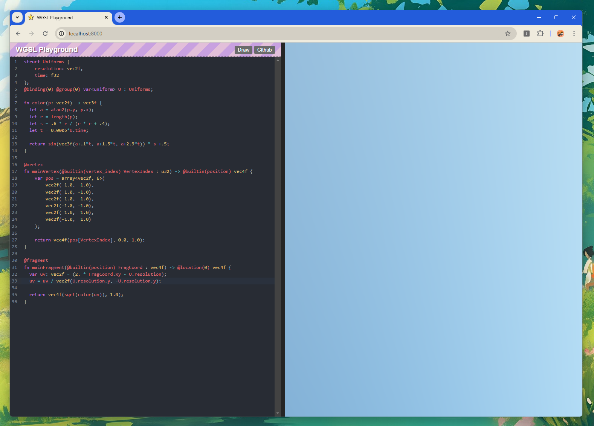

# WGSL Editor

A simple editor to write shaders on the brawser. 🌍

This project uses [codemirror-lang-wgsl](https://github.com/iizukak/codemirror-lang-wgsl) as the WGSL language support lib for Codemirror.